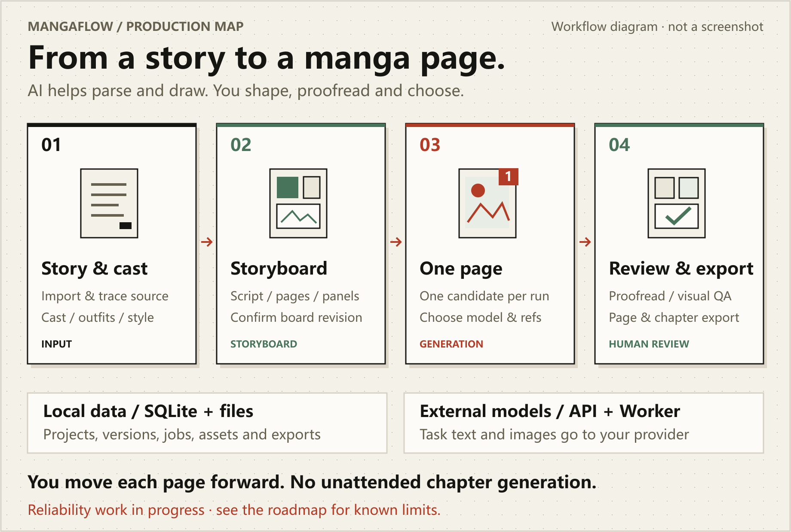

<p align="center">
  
</p>
<p align="center">
  <strong>English</strong> · <a href="README.zh-CN.md">简体中文</a>
</p>
<p align="center">
  <a href="package.json"></a>
  <a href="apps/api/pyproject.toml"></a>
</p>
<p align="center">
  <a href="scripts/start-dev.ps1"></a>
  <a href="docs/roadmap.md"></a>
</p>
<p align="center"><strong>Turn stories into manga. Keep creative decisions in your hands.</strong></p>

MangaFlow AI is a private, single-user AI manga workbench for novelists and manga creators. Keep source text, character and outfit references, storyboards, and page candidates in one traceable workflow. AI helps parse and draw; you move page by page, proofread, and choose which version to use.

The workbench UI is primarily in Chinese. This repository provides English and Simplified Chinese READMEs, not a fully localized application.

[Promo video](#promo-video) · [How it works](#how-it-works) · [Windows release](#windows-desktop-release) · [Quick start](#quick-start) · [Development and checks](#development-and-checks) · [Documentation](#documentation)

> [!IMPORTANT]
> The current Windows build is the `v1.0.0-rc2` release candidate. The main workflow is implemented, but the installer is not code-signed and several real-provider, multi-display/DPI, and long-session acceptance cases remain open. Do not treat it as a production-stable release. See the [main-branch roadmap](docs/roadmap.md) for impact and priorities.

<picture>
  <source media="(max-width: 600px)" srcset="assets/readme/overview-mobile-en.png">
  
</picture>

Story and references → script and storyboard → page candidate → human proofreading, selection, and visual checks → finished pages and chapter exports.

This is a workflow diagram, not a product screenshot. MangaFlow is not an unattended whole-chapter generator: you decide when to start the next page.

## Promo video

<p align="center">
  <a href="assets/readme/mangaflow-promo.mp4"></a>
</p>

[Watch the 56-second promo video](assets/readme/mangaflow-promo.mp4). This animation illustrates the workflow; it is not a recording of the application UI.

## How it works

### Built around everyday creative decisions

- **Reach page ten without losing the source of a line.** Source revisions and text ranges stay linked to the storyboard, so you can revisit the story behind the image.
- **Keep a costume change out of prompt guesswork.** Manage character, outfit, and style references separately and bind them before generation. Concept images start as drafts and require human confirmation before use.
- **Try another version without giving up the choice.** Keep multiple batches and cross-model candidates for a page. Favorites and the selected candidate are separate; withdrawing a selection does not delete the original image.

### Existing capabilities

| What you want to do | What the workbench provides |
| --- | --- |
| Turn a novel into traceable input | Paste, TXT, and Markdown import; source revisions, lossless segments, and coverage checks |
| Organize the cast and visual references | Names and aliases, character and outfit references, style palettes, and test images |
| Plan pages from text | Scripts, Scenes / Beats, dynamic pagination, and storyboards; distinguish on-screen, off-screen, and mentioned characters |
| Explore versions of the same page | Explicit model selection or routing among verified models; candidate batches, favorites, and one selected version |
| Review and package the result | Human text proofreading, multimodal visual checks and repair; PNG, PDF, project JSON, and asset-manifest exports |
| Arrange repeatable creative steps | Editable, publishable, runnable DAG workflows; fullscreen and focus modes, collapsible panels, canvas navigation, persisted jobs, and human confirmation nodes |
| Track model usage and cost | Per-dispatch provider/model ledger, input/output/cache tokens, image counts, versioned price estimates, CSV export, and separately reconciled provider bills |

These are implemented entry points, not a guarantee that every failure path has passed acceptance. A successful cancellation response does not yet guarantee that external calls have stopped, and an inspection summary alone does not prove that a page is ready for delivery. See the [roadmap](docs/roadmap.md) for the confirmed gaps.

## Windows desktop release

[Download MangaFlow Desktop `v1.0.0-rc2` for Windows x64](https://github.com/coffe01-10/MangaFlow/releases/tag/v1.0.0-rc2). The release contains the per-user NSIS installer and a SHA-256 checksum file. It targets the .NET 10 Windows Desktop Runtime and uses the native WPF client; no WebView is required.

The installer supports clean installation and in-place upgrades. Uninstalling the application leaves project data under `%LOCALAPPDATA%\MangaFlow\Native` in place. This candidate is not Authenticode-signed, so Windows may show an unknown-publisher warning; compare the installer against the checksum published with the release before running it.

The workflow editor in `rc2` uses the shared paper, ink, and vermilion theme and starts at 100% zoom. Its presentation controls are available from one **View** menu:

- `F11` toggles window fullscreen; `Esc` restores the previous window state.
- `Ctrl+Shift+Enter` toggles focus mode and restores the previous panel layout when leaving it.
- `Shift+wheel` scrolls horizontally, `Ctrl+wheel` zooms, and the normal wheel scrolls vertically.
- Space + drag or middle-button drag pans the canvas; **Fit workflow** frames the complete graph.

The source-development instructions below remain available for contributors and for running the Web workbench.

## Quick start

The commands below target **Windows PowerShell** and run from the repository root. Install Git, Node.js 22+, and Python 3.12+. SQLite is the default database; Redis is optional for local development. Version requirements come from [package.json](package.json) and [pyproject.toml](apps/api/pyproject.toml).

### 1. Set up the environment

For a new checkout:

```powershell
git clone https://github.com/coffe01-10/MangaFlow.git
cd MangaFlow
```

If you already have the repository, open that directory instead of cloning it again.

> Setup downloads Node / Python dependencies, creates `.venv`, `node_modules`, `storage`, and `uploads`, copies `.env.example` to `.env` only if it is missing, and applies Alembic migrations. [Back up existing data first](docs/local-development.md#数据与备份). Setup does not call AI models as part of installation.

```powershell
powershell -ExecutionPolicy Bypass -File .\scripts\setup-codex.ps1
```

Configuration options are listed in [.env.example](.env.example). Opening the workbench and checking the database does not require Vertex credentials. Configure a provider before using AI features; do not use example placeholders as real credentials.

### 2. Start the workbench

```powershell
powershell -ExecutionPolicy Bypass -File .\scripts\start-dev.ps1
```

Use this command for everyday startup once the environment is ready. It migrates the database before starting the Web and API services. In development, `AUTO` queue mode falls back to the local executor when Redis is unavailable.

- [Open the workbench](http://127.0.0.1:3000)
- [Browse the API documentation](http://127.0.0.1:8000/api/docs)
- [Check the API and database connection](http://127.0.0.1:8000/api/v1/health)

Development and production start scripts bind Web and API to `127.0.0.1`. This is a private single-user workbench with no accounts: anyone who can reach the ports can read and write projects. Do not expose it to untrusted networks until authentication is added. CORS is not access control.

### 3. Verify your first startup

In a second PowerShell window:

```powershell
Invoke-RestMethod http://127.0.0.1:8000/api/v1/health
```

Expect `status: ok` and `database: ok`, and confirm that the workbench opens. This checks API and database connectivity only; it does not validate provider credentials or image generation.

Press `Ctrl+C` in the startup window to stop. If a port is occupied, check whether a development service is already running. Proxy configuration, manual startup, Redis/RQ, and Codex setup are covered in the [local development and data guide](docs/local-development.md) (Chinese).

## Create your first manga page

> [!WARNING]
> Capability tests, text parsing, image generation, and visual checks may send text or images to your configured provider and incur charges. Review the provider, pricing, and data-retention policy before starting. Default tests do not establish a production workflow with real paid providers.

1. **Connect models.** Configure a provider and API key in Settings, then test the capabilities you need. Page generation requires an image model with `image_edit`; automatic routing uses only models marked `VERIFIED` for the relevant capability.
2. **Build the creative context.** Create a project and chapter, import the source, and organize character, outfit, and style references. Confirm AI concept drafts before using them as canonical references.
3. **Decide what this page should tell.** Parse the script, paginate, and edit the storyboard. Check the cast, dialogue, and source links; confirm the current storyboard revision and references before generating.
4. **Generate one candidate.** Choose a model and start single-page generation. Keep the existing result and request another candidate if needed. This does not automatically generate the next page.
5. **Proofread, then select.** Review text and visuals, run visual checks, and repair or regenerate when needed. The intended workflow requires complete, passing checks for speaker, character, outfit, prop, and continuity; current completeness gaps still require human review.
6. **Package the result.** Confirm each page before moving on. Use chapter export once all pages are ready, and inspect the exported files before delivery.

Text is proofread by a person; there is no promise of automatic OCR correction. This is not a layered drawing editor. The [development progress](docs/development-progress.md) and [roadmap](docs/roadmap.md) describe the current capabilities and unfinished work.

## Models and data boundaries

Compatible provider connections support the `OPENAI` and `ANTHROPIC` protocols. Vertex AI and Gemini API retain native connections. Settings includes provider presets, custom base URLs, model discovery, manual entries, and capability tests. **A preset or model appearing in a list does not mean it is usable by your account.** See the [provider and model platform guide](docs/provider-platform.md) for connection and routing rules.

The default setup stores metadata in local SQLite and assets in local directories, but it is not fully offline software: API / Worker calls send the data needed for a task to the configured external service.

- API keys are encrypted on the server. Development can generate a local master key when a key is first saved; production requires an explicit `MANGAFLOW_CREDENTIAL_MASTER_KEY`.
- Defaults: `storage/mangaflow.db` for metadata, `storage/generated/` for generated images, `uploads/` for uploaded assets, and `storage/exports/` for exports.
- Normal project or asset deletion is a soft delete, not immediate disk-space recovery. Withdrawing a candidate selection also leaves its original image intact.
- A Git commit does not include this local data and is not a backup. Moving to another machine requires the database, assets, and keys needed for decryption; see the [backup guide](docs/local-development.md#数据与备份).

The repository targets local, single-user use. Default listeners are loopback-only; do not publish the development server to other network interfaces or the public internet. Never commit `.env`, service-account JSON, keys, local databases, or generated media.

Optional Docker Compose services for PostgreSQL and Redis bind to `127.0.0.1` only. Compose Redis uses AUTH (local default `mangaflow-dev`, not a production secret). Set `REDIS_URL=redis://:mangaflow-dev@127.0.0.1:6379/0` when using those containers. Change an existing database password with `ALTER USER`; do not delete user data volumes.

### Usage and cost ledger

The usage window does not count tokens from rendered text or intercept a live token stream. Before each paid provider dispatch, the backend commits a pending audit row. After the call finishes, the adapter records the provider's final `usage` or `usage_metadata` payload; CLI integrations read the final result event. OpenAI-compatible, Gemini/Vertex, cached-input, reasoning-token, and image-count fields are normalized into one ledger while the original payload is retained for diagnosis.

Missing provider usage remains **unknown**, never zero. A failed request can still carry usage when the provider accepted and billed it, and each real retry or key switch receives its own attempt row. The dashboard applies the price version active at dispatch time to produce an estimate; it presents imported provider-bill reconciliation separately and never adds different currencies together. The desktop page loads a database snapshot on entry, filter changes, and refresh, so final token totals normally appear after the call is finalized rather than changing token by token. See the [usage ledger contract](docs/v02-usage-ledger-contract.md) for the data model and boundaries.

## Development and checks

The frontend uses Next.js 16 / React 19; the backend uses FastAPI / SQLAlchemy. Alembic manages database versions. Add a migration for schema changes instead of editing the database manually or relying on startup-time `create_all`.

| Command | Actual scope |
| --- | --- |
| `npm run dev` | Start Web and API together; apply database migrations first when starting manually |
| `npm run dev:full` | Also start an RQ Worker; use only with Redis ready and matching queue configuration |
| `npm run check` | ESLint, Ruff, Pytest, Vitest, and a Next.js production build including TypeScript checks |
| `npm run check:full` | The checks above plus Playwright browser tests; existing scenarios include Axe checks |

Default checks do not make real Vertex image calls. They do not replace Lighthouse, workflow FPS, real-provider, or sustained-production acceptance. Historical results and current coverage gaps are kept in the [roadmap](docs/roadmap.md); a static “build passing” badge would not represent live CI status.

```text
apps/api/app/         API, services, domain rules, and model adapters
apps/api/migrations/  Alembic database migrations
apps/web/             Pages, components, and client utilities
tests/                Python and browser tests
scripts/              Setup, development, and documentation artwork scripts
docs/                 Architecture, progress, roadmap, and operational guides
```

Add regression tests for behavior changes and update documentation when architecture or data structures change. See [AGENTS.md](AGENTS.md) for contribution and review conventions.

## Documentation

The linked deep-dive documents are primarily in Simplified Chinese.

| What you want to know | Start here |
| --- | --- |
| Current priorities and the remaining work for a stable release | [Main-branch roadmap](docs/roadmap.md) |
| Implementation progress and history | [Development progress](docs/development-progress.md) |
| Environment, proxy, standalone Worker, backup, and recovery | [Local development and data guide](docs/local-development.md) |
| Provider connections, model capabilities, and automatic routing | [Provider and model platform](docs/provider-platform.md) |
| Module boundaries and data relationships | [Architecture](docs/architecture.md) · [Data model](docs/data-model.md) |
| Original product plan | [Requirements](plan.md); planned features are not necessarily implemented |
| Logo, badges, diagrams, provenance, and regeneration | [README artwork notes](assets/readme/SOURCES.md) |

## License and artwork

The repository does not currently declare a project license. Do not assume that MangaFlow is MIT-licensed.

The README structure : a centered brand area, two rows of local badges, an overview, use cases, and onboarding. The manga-page emblem, palette, and workflow diagrams are tailored to MangaFlow. Pixel glyphs are adapted from its MIT-licensed artwork; see the full [pixel-font license](assets/readme/LICENSE.pixel-font.txt). That attribution covers the reused material and does not replace a project license for MangaFlow.
