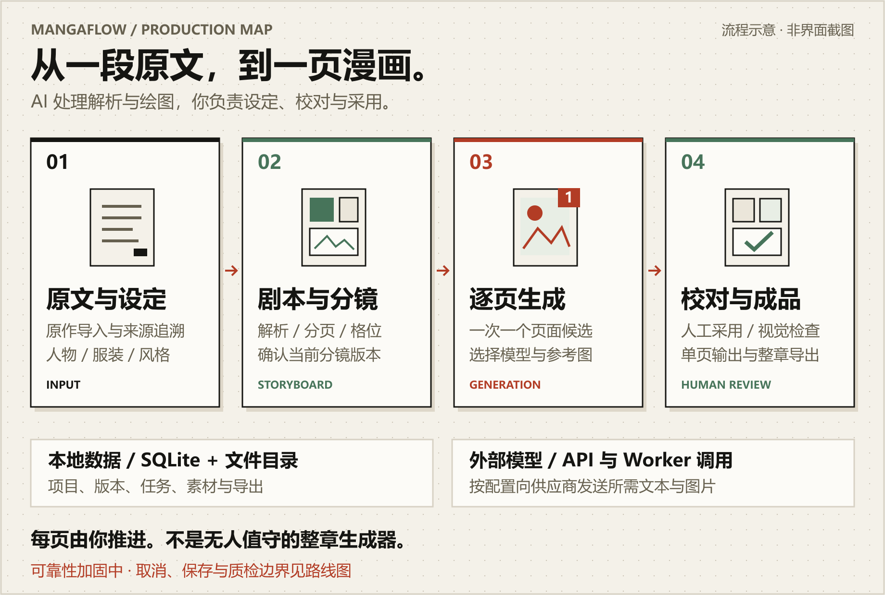

<p align="center">
  
</p>
<p align="center">
  <a href="README.md">English</a> · <strong>简体中文</strong>
</p>
<p align="center">
  <a href="package.json"></a>
  <a href="apps/api/pyproject.toml"></a>
</p>
<p align="center">
  <a href="scripts/start-dev.ps1"></a>
  <a href="docs/roadmap.md"></a>
</p>
<p align="center"><strong>让故事成为漫画，把决定权留给创作者。</strong></p>

MangaFlow AI 是面向小说作者与漫画创作者的私有、单用户 AI 漫画工作台。把原文、人物与服装参考、分镜和页面候选放进同一条可追溯的流程：AI 参与解析与绘图，你按页推进、校对并决定采用哪个版本。

当前工作台界面和深入文档以中文为主；提供中英文 README 不代表应用界面已完成国际化。

[工作方式](#工作方式) · [快速开始](#快速开始) · [开发与验证](#开发与验证) · [文档导航](#文档导航)

> [!IMPORTANT]
> 当前处于可靠性加固阶段。主流程已有实现，但取消与任务调度、工作流保存、质检完整性仍有已确认问题，不应视为稳定生产版本。具体影响与修复优先级见[主分支路线图](docs/roadmap.md)。

<picture>
  <source media="(max-width: 600px)" srcset="assets/readme/overview-mobile.png">
  
</picture>

原文与设定 → 剧本与分镜 → 单页候选 → 人工校对、采用与视觉检查 → 单页成品与整章导出。

这是一张业务流程图，不是产品截图。MangaFlow 也不是无人值守的整章生成器：下一页仍由你决定何时开始。

## 工作方式

### 从创作中的具体问题出发

- **改到第十页，还知道对白来自哪里。** 原作修订、来源区间与分镜保留关联，便于回看故事依据，而不是只留下几张图片。
- **角色换装，不必靠一段提示词记住一切。** 人物、服装和风格参考分别管理，生成前明确绑定；概念设定图先作为草稿，由人确认后使用。
- **这一版不好，可以再试，但不替你做决定。** 同一页保留多批次、跨模型候选；收藏与采用分开，撤回采用不会删除原图。

### 已有能力

| 你要完成的事 | 工作台提供的支持 |
| --- | --- |
| 把小说整理成可追溯的输入 | 粘贴、TXT、Markdown 导入；原作修订、无损片段与覆盖率检查 |
| 组织角色与画面设定 | 姓名与别名、人物与服装参考、风格色板和测试图 |
| 把文字变成页面计划 | 剧本、Scene / Beat、动态分页和分镜；区分出镜、画外与提及人物 |
| 对同一页反复试稿 | 显式选模型或从已验证模型中路由；多批次候选、收藏和单个采用版本 |
| 复核后整理成品 | 人工文字校对、多模态视觉检查与修复；PNG、PDF、项目 JSON 和素材清单导出 |
| 编排重复的创作步骤 | 可编辑、发布和运行的 DAG 工作流；持久化任务与人工确认节点 |

这些是已有功能入口，不代表所有异常路径都已验收。尤其不要仅凭“任务取消成功”判断已停止外部调用，也不要仅凭质检汇总状态判定成品可交付；当前缺陷见[路线图](docs/roadmap.md)。

## 快速开始

以下命令面向 **Windows PowerShell**，在仓库根目录执行。需要 Git、Node.js 22+、Python 3.12+；默认使用 SQLite，本地开发不强制安装 Redis。版本要求分别来自 [package.json](package.json) 与 [pyproject.toml](apps/api/pyproject.toml)。

### 1. 准备环境

首次克隆时执行：

```powershell
git clone https://github.com/coffe01-10/MangaFlow.git
cd MangaFlow
```

已有仓库则直接进入该仓库目录，不必再次克隆。

> 初始化脚本会联网安装 Node / Python 依赖，创建 `.venv`、`node_modules`、`storage`、`uploads`，在缺失时从 `.env.example` 复制 `.env`，并应用 Alembic 数据库迁移。已有数据请先[备份](docs/local-development.md#数据与备份)；脚本不会为了安装而调用 AI 模型。

```powershell
powershell -ExecutionPolicy Bypass -File .\scripts\setup-codex.ps1
```

配置项见 [.env.example](.env.example)。仅打开工作台和检查数据库不要求配置 Vertex；使用 AI 功能时，再按下文配置供应商。不要把示例占位符当作真实密钥。

### 2. 启动工作台

```powershell
powershell -ExecutionPolicy Bypass -File .\scripts\start-dev.ps1
```

日常已有环境直接运行这一条即可。脚本先迁移数据库，成功后启动 Web 与 API；在开发环境，`AUTO` 队列模式未连接 Redis 时使用本地执行器。

- [打开工作台](http://localhost:3000)
- [查看 API 文档](http://localhost:8000/api/docs)
- [检查 API 与数据库连接](http://localhost:8000/api/v1/health)

### 3. 确认第一次启动成功

在另一个 PowerShell 窗口执行：

```powershell
Invoke-RestMethod http://localhost:8000/api/v1/health
```

预期返回的两个字段为 `status: ok`、`database: ok`，同时工作台可以打开。此检查只验证 API 与数据库连通，不证明供应商凭据有效或图片生成可用。

停止时在启动窗口按 `Ctrl+C`。若端口被占用，先检查是否已有开发服务运行；代理、手动启动、Redis/RQ 和 Codex 环境配置见[本地开发与数据管理](docs/local-development.md)。

## 第一张漫画怎么走

> [!WARNING]
> 模型能力测试、文本解析、绘图和视觉检查可能向配置的供应商发送文本或图片，并产生费用。开始前确认供应商、价格与数据保留政策。默认测试不验证真实付费供应商的生产闭环。

1. **接入模型。** 在设置页配置供应商与 API Key，测试需要的能力。页面生成需要支持 `image_edit` 的图片模型；自动路由只使用对应能力已标记为 `VERIFIED` 的模型。
2. **建立创作上下文。** 创建项目与章节，导入原作，整理人物、服装和风格参考；AI 概念图经人工确认后再用作规范参考。
3. **确认这一页要讲什么。** 解析剧本、分页并编辑分镜，核对出镜人物、对白和来源；生成前确认当前分镜版本与参考素材。
4. **生成一个候选。** 选择模型并发起单页生成。不满意就保留已有结果，再生成新的候选；不会因此自动生成下一页。
5. **校对，再决定采用。** 人工核对文字和画面，运行视觉检查，必要时修复或重生成。目标流程要求说话人、角色、服装、道具和连续性五类检查完整且通过；当前完整性校验缺口仍需人工复核。
6. **整理成品。** 单页确认后继续下一页；章节页面都准备好后，再使用章节导出。正式交付前检查导出的实际文件。

文字采用人工校对，不承诺 OCR 自动纠错；项目也不是分层绘画编辑器。详细的当前能力与未完成项以[开发进度](docs/development-progress.md)和[路线图](docs/roadmap.md)为准。

## 模型与数据边界

兼容供应商连接支持 `OPENAI`、`ANTHROPIC` 两种协议；Vertex AI 与 Gemini API 保留原生连接。设置页提供供应商预设、自定义 Base URL、模型发现、手动添加和能力测试。**预设或模型名称出现在列表里，不等于当前账号已可用。** 接入范围与路由规则见[供应商与模型平台](docs/provider-platform.md)。

项目默认采用本地 SQLite 与文件目录存储，但不是完全离线软件：调用模型时，API / Worker 会向所配置的外部服务发送本次任务需要的数据。

- API Key 由服务端加密保存；开发环境首次保存时可生成本机主密钥，生产环境须显式配置 `MANGAFLOW_CREDENTIAL_MASTER_KEY`。
- 数据库默认在 `storage/mangaflow.db`，生成图在 `storage/generated/`，上传素材在 `uploads/`，导出在 `storage/exports/`。
- 删除项目或素材通常是软删除，不等于立即释放磁盘空间。候选撤回也不删除原图。
- Git 提交不包含这些本地数据，也不是备份。迁移机器要同时考虑数据库、素材和解密所需的密钥，见[备份说明](docs/local-development.md#数据与备份)。

仓库按本地单用户使用设计，不把开发服务器直接暴露到公网。`.env`、服务账号 JSON、密钥、本地数据库和生成素材都不应提交。

## 开发与验证

前端是 Next.js 16 / React 19，后端是 FastAPI / SQLAlchemy，数据库版本由 Alembic 管理。修改表结构应新增迁移，不手工改库，也不依赖启动时 `create_all` 建表。

| 命令 | 实际范围 |
| --- | --- |
| `npm run dev` | 同时启动 Web 与 API；手动使用前需先执行数据库迁移 |
| `npm run dev:full` | 额外启动 RQ Worker；仅在 Redis 已就绪、队列配置匹配时使用 |
| `npm run check` | ESLint、Ruff、Pytest、Vitest、含 TypeScript 检查的 Next.js 生产构建 |
| `npm run check:full` | 上述检查，加上 Playwright 浏览器测试；现有场景包含 Axe 检查 |

默认检查不进行真实 Vertex 图片调用，也不等于 Lighthouse、工作流 FPS、真实供应商或持续生产验收。历史通过记录与当前未覆盖场景统一记录在[路线图](docs/roadmap.md)，这里不使用静态“构建通过”徽章代替 CI 状态。

```text
apps/api/app/         API、服务、领域规则与模型适配
apps/api/migrations/  Alembic 数据库迁移
apps/web/             页面、组件与客户端工具
tests/                Python 与浏览器测试
scripts/              环境、开发与文档素材脚本
docs/                 架构、进度、路线图与操作说明
```

行为变更应添加回归测试，架构与数据结构变化同步更新文档。提交与审查约定见 [AGENTS.md](AGENTS.md)。

## 文档导航

| 想了解什么 | 从这里开始 |
| --- | --- |
| 当前优先修什么、稳定版还差什么 | [主分支路线图](docs/roadmap.md) |
| 功能实现进度与历史记录 | [开发进度](docs/development-progress.md) |
| 环境、代理、独立 Worker、备份与恢复 | [本地开发与数据管理](docs/local-development.md) |
| 供应商接入、模型能力与自动路由 | [供应商与模型平台](docs/provider-platform.md) |
| 模块边界和数据关系 | [系统架构](docs/architecture.md) · [数据模型](docs/data-model.md) |
| 产品原始规划 | [需求方案](plan.md)；规划不等于已实现能力 |
| Logo、徽章、概览图的来源与再生成 | [README 素材说明](assets/readme/SOURCES.md) |

## 许可证与素材

仓库目前未声明项目许可证，不应默认视为 MIT 授权项目。

README 的图文组织参考：居中品牌区、两行本地徽章、概览、使用场景和上手路径。漫画页图标、项目配色与业务图为 MangaFlow 定制；像素字形沿用其 MIT 授权素材，完整声明见[像素字形许可证](assets/readme/LICENSE.pixel-font.txt)。该许可仅说明所复用素材的来源，不替代 MangaFlow 的项目许可证。
