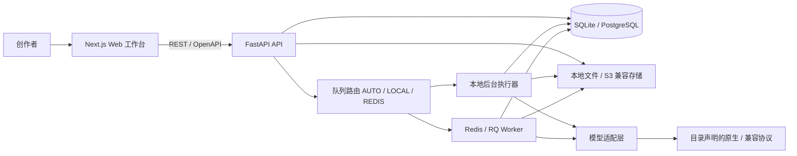
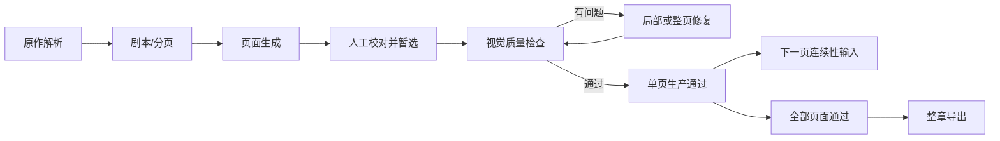

# MangaFlow AI 技术架构

## 1. 架构目标

MangaFlow AI 围绕“原作 → 资产 → 剧本 → 分页 → 单页抽卡 → 检查修复 → 导出”建设。结构化数据是事实来源，提示词和图片是可追溯派生物；浏览器不持有供应商凭据；任何付费 AI 创建操作都进入持久化任务。

## 2. 系统边界



本地默认使用 SQLite 和本地文件。任务元数据始终先写入数据库。`LOCAL` 直接使用受并发限制的本地后台执行器；`AUTO` 在开发环境无法连接 Redis 时自动使用本地执行器；`REDIS` 必须进入 RQ，Redis 不可用时任务保留为 `WAITING`。生产环境可替换为 PostgreSQL、对象存储和独立 RQ Worker。

## 3. 代码结构

```text
.
├── apps/
│   ├── web/                         # Next.js、React、TypeScript
│   └── api/
│       ├── app/api/routes/          # REST 接口
│       ├── app/model_adapters/      # 原生与 OpenAI/Anthropic 兼容适配器
│       ├── app/services/            # 分段、分页、任务、提示词服务
│       ├── app/services/worker_handlers/  # 按任务类型拆分的 Worker 业务 handler
│       ├── app/worker_tasks.py      # RQ 任务执行外壳（claim/租约/取消/重试收敛与 dispatch）
│       └── migrations/              # Alembic
├── docs/
├── storage/
├── uploads/
├── tests/
├── docker-compose.yml
└── package.json
```

## 4. 业务模块

- `projects`：项目配置、上次使用模型、乐观锁和软删除。
- `sources`：粘贴/TXT/Markdown 导入、不可变修订、章节、无损片段和来源覆盖率。
- `characters`：主要姓名、绰号、冲突、参考图、服装和字段锁定。
- `story/pages`：Scene、Beat、剧本、动态分页、右至左分镜和来源映射。
- `batches/candidates`：页面或资产批次、候选、收藏、采用、下一页和软删除。
- `jobs`：任务提交、DAG、幂等、取消、重试、超时、租约和并发限制。
- `inspection/repair`：文字、说话人、角色、服装、道具和连续性检查及分级修复；文字识别是人工校对辅助项，不自动触发付费修图，采用时需显式人工确认。
- `library/exports`：批次素材库、PNG、PDF、项目 JSON 和素材清单。

所有 AI 创建接口返回 `202 + job_id`；普通查询只读数据库和存储，不触发模型调用。

## 5. 任务队列

`GenerationJob` 使用 `JobDependency` 表达 DAG。依赖未完成的任务保持 `WAITING`；依赖完成后由当前实际执行器运行。任务支持幂等键、取消标记、最大尝试次数、超时、租约和每项目并发上限；API 启动时会恢复本地模式遗留的可执行等待任务。



修复自动尝试最多三次。失败任务互相隔离，重试创建新的调度尝试但保留原始审计记录。

RQ 并发名额等待在当前 Worker 的原队列与连接上创建延迟任务，使用不含冒号的独立调度 ID，数据库任务 ID 保持不变，等待不增加实际尝试次数。重新调度按剩余尝试次数保留重试策略；投递失败交给 RQ 错误处理，不在短生命周期的任务子进程内偷偷切换到本地线程。LOCAL 执行器继续使用自身的退避循环，不额外投递 Redis。

Worker 启动统一经过 `apps/api/run_worker.py` / `app.worker`，与 API 共用 `.env` 配置，自动启用调度器，并在 Windows 使用 `SpawnWorker`。

### 工作流草稿保存与版本发布

前端草稿按编辑代次串行保存，在途请求完成后补交新修改；保存失败保留待保存状态，后续手动或自动保存可重新发起请求。发布与校验必须等待最新草稿保存成功。

发布在事务内重新读取并校验同一份草稿，PostgreSQL 先锁定工作流行并刷新 Session 缓存，再分配 revision。唯一约束冲突或 SQLite BUSY/LOCKED 会回滚整个失败事务并有限重试；耗尽返回 409，不更改已发布指针。非锁类 OperationalError 不会伪装成发布冲突。此处没有 schema 变更；真实 PostgreSQL 并发验收仍待独立环境验证。

## 6. 动态分页与逐页生成

原作先拆为带字符区间和哈希的 `SourceSegment`，再映射到 Scene、Beat、剧本和 `MangaPage`。容量估算使用每页 3–5 格、最多 8 个气泡，中文对白/旁白软上限 120 字、硬上限 180 字；溢出时继续拆页，不压缩或删除情节。格内人物用 `VISIBLE/OFFSCREEN/MENTIONED` 表示，道具独立保存；没有实际出镜人物的场景页是合法页面。任何来源片段未映射、已有实际出镜人物却缺参考、场景服装缺失或正式风格未确认时，统一 readiness 服务拒绝候选请求。

页面规划可以一次完成，但图片只允许逐页生成。`GenerationBatch` 是同一页的一轮抽卡会话，`PageCandidate` 是一次模型调用的候选。收藏和暂选互相独立；暂选只表达人工选择，不代表成品。只有候选图存在、分镜版本已确认、视觉检查通过三项同时成立，页面才进入生产通过状态并成为下一页的连续性输入。默认 DAG 终点是单页成品；整章导出使用独立 DAG，并要求章节内所有页面生产通过。

视觉检查按 `candidate_id + storyboard_version` 隔离，五类各自最新结果必须全部通过。局部复检只补齐同一分镜版本的类别，不能借用旧分镜结果；检查期间分镜变化时只保存旧版本审计记录，不把新分镜标记通过。同一类别、同一时间戳的冲突结果按失败优先处理，不能用随机 UUID 排序推断检查先后；时间上更新的通过结果仍可解除旧失败。

## 7. 多供应商模型适配

`ProviderProfile → ProviderConnection → ProviderKey / AIModel` 构成供应商目录。连接定义协议、Base URL、端点模板、非敏感请求头、余额规则和唯一健康状态；协议能力声明模型发现与支持的模型类型，凭据来源声明为连接 Key、服务端环境账号或第三方管理的 CLI 会话。模型定义文字/图片类型、模态、操作、能力置信度与探测指标。所有协议使用相同的连接健康、目录、验证和任务绑定契约；适配器内部保留真实传输差异，但不形成 UI 排名、默认模型或自动路由加分。详细规则见 [`provider-platform.md`](provider-platform.md)。

| 协议 | 凭据来源 | 模型发现 | 目录模型类型 |
| --- | --- | --- | --- |
| `OPENAI` | 连接 API Key | 支持 | 文字、图片 |
| `ANTHROPIC` | 连接 API Key | 不支持 | 文字 |
| `GOOGLE_NATIVE` | 连接 API Key | 支持 | 文字、图片 |
| `VERTEX_NATIVE` | 服务端环境账号 | 不支持 | 文字、图片 |
| `CLI_CODEX` | 外部 CLI 会话 | 不支持 | 图片 |
| `CLI_ANTIGRAVITY` | 外部 CLI 会话 | 不支持 | 图片 |

旧逻辑别名仍可用，但只作为历史解析入口；新任务记录目录模型 ID。新项目和工作流不预选任何供应商模型：文字任务使用 `auto`，图片任务要求显式选择目录模型。连接凭据验证不生成内容，模型冒烟结果写入统一连接健康与 `ModelProbe`。模型发现只在协议能力声明允许时出现，不支持发现的连接使用预设或手动目录。自动路由只使用已完成能力测试的模型。模型错误统一归类为认证、权限、配额、限流、模型不可用、能力不支持、内容安全、超时、无效输出或上游错误。

旧 `ProviderHealth` 仅为 `/settings/vertex/*` 单版本兼容端点保留并由统一连接健康桥接；产品前端不读取它。删除兼容端点时可连同该表及桥接服务一并迁移移除，当前阶段不提前破坏旧客户端。

可选 CLI 图像通道走独立外部进程边界，不伪装成 HTTP API。公共 controller 按 run 建立受控目录、结构化请求/结果和输出清单，并关联 `ModelCallAttempt`；Windows runner 在子进程执行前将其加入 kill-on-close Job Object，取消和超时终止整棵进程树。数据库唯一槽位限制每连接并发，恢复仅在 controller 与 Job Object 均确认停止后释放；公共层不会静默切换到 HTTP 通道。Codex 适配器只执行原生 `codex.exe`，把用户 prompt 留在校验和保护的 request 文件而非 argv，以 `workspace-write`、无审批、临时会话及忽略用户配置的 `codex exec` 调用 `$imagegen`。Antigravity 适配器只执行原生 `agy.exe`，使用 sandbox、禁用 slash 扩展、限时 JSON print 模式和 run-owned 私有 HOME；官方 JSON envelope 由适配器归一化为公共 `result.json`，只从该私有 HOME 的 artifact 树采用唯一且通过链接、路径、数量、格式、像素和大小校验的图片。两个通道的设置页都只做只读登录/版本/参数能力探测，付费图片验证必须复用真实任务和审计链。

## 8. 安全与可观测性

- 服务账号 JSON 和 AES-256-GCM 加密的供应商 API Key 仅由 API/Worker 读取。
- 自定义供应商执行 HTTPS、DNS/IP、私网、保护请求头和禁止重定向检查。
- `.env`、服务账号 JSON、数据库、上传素材和生成输出均被 Git 忽略。
- API 只返回配置状态与脱敏错误，不返回凭据路径、邮箱、令牌或认证头。
- 上传执行扩展名、MIME、大小、文件头、哈希去重和路径穿越检查。
- 上传表单由异步依赖限量解析并确保关闭文件；同步路由在 FastAPI 线程池中执行图片处理、正文导入和数据库操作，不占用事件循环执行耗时同步业务。
- 每次模型调用记录任务、模型、参数摘要、提示词版本、参考资产、时间、输出、重试次数和脱敏错误。

## 9. 部署与验证

开发模式可直接用 `npm run dev` 启动 Web 和 API；默认 `AUTO` 会在无 Redis 时使用本地执行器。需要验证独立 RQ 时使用 `npm run dev:full`；Docker Compose 提供 PostgreSQL 与 Redis。数据库迁移由 Alembic 管理，生产启动只检查版本，不自动升级。

自动检查入口为 `npm run check`，包括 Ruff、ESLint、Pytest 和 Next.js 生产构建；迁移另做 SQLite 升级/回滚验证。真实供应商和任何可能计费的模型调用不属于默认测试，避免意外费用。

浏览器与性能门禁分别位于 `tests/e2e/platform-v2.spec.ts`、`apps/web/scripts/lighthouse-gate.mjs` 和 `apps/web/scripts/workflow-fps-gate.mjs`。后两者要求本地 Web/API 已启动；工作流 FPS 脚本会创建临时 100 节点项目，完成 10 秒拖动/缩放采样后立即删除临时工作流和项目。


## 10. 序号分配与事务所有权（P1-5）

章节、原文修订、生成批次和页面/素材候选的序号使用既有唯一约束，分配逻辑集中在服务层。PostgreSQL 按项目、章节或页面、批次的顺序获取相关行锁；不使用进程内互斥锁冒充跨 Worker 并发控制。

SQLite 的 legacy 事务模式不会为 SELECT/SAVEPOINT 自动开启物理外层事务。序号尝试显式确保 BEGIN，在保存点内通过不修改任何数据行的 UPDATE 取得数据库写锁，再读取 MAX 与校验状态；RELEASE 保存点不会提前提交整个操作。每次失败仅回滚自身保存点，并刷新 ORM 缓存，调用方已 flush 的修改不会被辅助函数悄悄丢弃。默认最多尝试 5 次，退避有上限；已有旧读快照无法升级时返回受控 409，调用方须回滚并重新发起完整操作。

候选与 GenerationJob、工作流审批运行/节点状态在同一外层事务提交，成功后才入队；create_job 的 auto_commit=False 用于这些调用。模型解析和页面就绪校验显式禁止预设初始化内部提交，独立查询与启动初始化保留原有提交行为。最终提交发生数据库锁/唯一约束冲突时回滚整个操作并返回 409，不在丢掉调用方工作后盲目继续局部重试。

此修复无数据库结构或迁移变更。验收覆盖隔离 SQLite 的独立 Session 并发、唯一键碰撞、失败回滚、最终提交失败及恢复；真实 PostgreSQL/Redis、浏览器和供应商调用不属于本轮已完成的验证。
