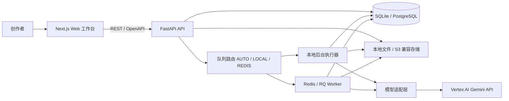
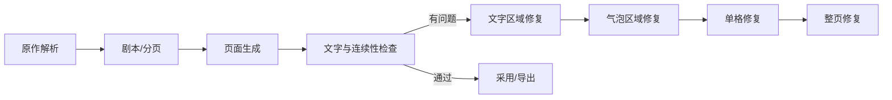

# MangaFlow AI 技术架构

## 1. 架构目标

MangaFlow AI 围绕“原作 → 资产 → 剧本 → 分页 → 单页抽卡 → 检查修复 → 导出”建设。结构化数据是事实来源，提示词和图片是可追溯派生物；浏览器不持有 Vertex 凭据；任何付费 AI 创建操作都进入持久化任务。

## 2. 系统边界



本地默认使用 SQLite 和本地文件。任务元数据始终先写入数据库。`LOCAL` 直接使用受并发限制的本地后台执行器；`AUTO` 在开发环境无法连接 Redis 时自动使用本地执行器；`REDIS` 必须进入 RQ，Redis 不可用时任务保留为 `WAITING`。生产环境可替换为 PostgreSQL、对象存储和独立 RQ Worker。

## 3. 代码结构

```text
.
├── apps/
│   ├── web/                         # Next.js、React、TypeScript
│   └── api/
│       ├── app/api/routes/          # REST 接口
│       ├── app/model_adapters/      # Vertex 文本/图像适配器
│       ├── app/services/            # 分段、分页、任务、提示词服务
│       ├── app/worker_tasks.py      # RQ 任务执行器
│       └── migrations/              # Alembic
├── docs/
├── storage/
├── uploads/
├── tests/
├── docker-compose.yml
└── package.json
```

## 4. 业务模块

- `projects`：项目配置、上次使用模型、乐观锁和软删除。
- `sources`：粘贴/TXT/Markdown 导入、不可变修订、章节、无损片段和来源覆盖率。
- `characters`：主要姓名、绰号、冲突、参考图、服装和字段锁定。
- `story/pages`：Scene、Beat、剧本、动态分页、右至左分镜和来源映射。
- `batches/candidates`：页面或资产批次、候选、收藏、采用、下一页和软删除。
- `jobs`：任务提交、DAG、幂等、取消、重试、超时、租约和并发限制。
- `inspection/repair`：文字、说话人、角色、服装、道具和连续性检查及分级修复；文字识别是人工校对辅助项，不自动触发付费修图，采用时需显式人工确认。
- `library/exports`：批次素材库、PNG、PDF、项目 JSON 和素材清单。

所有 AI 创建接口返回 `202 + job_id`；普通查询只读数据库和存储，不触发模型调用。

## 5. 任务队列

`GenerationJob` 使用 `JobDependency` 表达 DAG。依赖未完成的任务保持 `WAITING`；依赖完成后由当前实际执行器运行。任务支持幂等键、取消标记、最大尝试次数、超时、租约和每项目并发上限；API 启动时会恢复本地模式遗留的可执行等待任务。



修复自动尝试最多三次。失败任务互相隔离，重试创建新的调度尝试但保留原始审计记录。

## 6. 动态分页与逐页生成

原作先拆为带字符区间和哈希的 `SourceSegment`，再映射到 Scene、Beat、剧本和 `MangaPage`。容量估算使用每页 3–5 格、最多 8 个气泡，中文对白/旁白软上限 120 字、硬上限 180 字；溢出时继续拆页，不压缩或删除情节。格内人物用 `VISIBLE/OFFSCREEN/MENTIONED` 表示，道具独立保存。任何来源片段未映射、实际出镜人物缺参考、场景服装缺失或正式风格未确认时，统一 readiness 服务拒绝候选请求。

页面规划可以一次完成，但图片只允许逐页生成。`GenerationBatch` 是同一页的一轮抽卡会话，`PageCandidate` 是一次模型调用的候选。收藏和采用互相独立；每页只有一个当前采用版本，该版本才会成为下一页的连续性输入。

## 7. Vertex AI 模型适配

| 逻辑别名 | 默认 Vertex 模型 ID | 说明 |
| --- | --- | --- |
| `text.fast` | `gemini-3.5-flash` | 结构化解析、剧本和多模态检查 |
| `image.nano_banana_2` | `gemini-3.1-flash-image` | 与 Pro 平级的页面/资产/修复模型 |
| `image.nano_banana_pro` | `gemini-3-pro-image-preview` | 与 NB2 平级的页面/资产/修复模型 |

两个图像模型都声明 1K、2K、4K 能力，4K 标记 Preview。业务代码使用逻辑别名，真实模型 ID 由环境变量配置。模型错误统一归类为认证、权限、配额、限流、模型不可用、能力不支持、内容安全、超时、无效输出或上游错误。

## 8. 安全与可观测性

- 服务账号 JSON 只由 `GOOGLE_APPLICATION_CREDENTIALS` 指向，仅 API/Worker 读取。
- `.env`、服务账号 JSON、数据库、上传素材和生成输出均被 Git 忽略。
- API 只返回配置状态与脱敏错误，不返回凭据路径、邮箱、令牌或认证头。
- 上传执行扩展名、MIME、大小、文件头、哈希去重和路径穿越检查。
- 每次模型调用记录任务、模型、参数摘要、提示词版本、参考资产、时间、输出、重试次数和脱敏错误。

## 9. 部署与验证

开发模式可直接用 `npm run dev` 启动 Web 和 API；默认 `AUTO` 会在无 Redis 时使用本地执行器。需要验证独立 RQ 时使用 `npm run dev:full`；Docker Compose 提供 PostgreSQL 与 Redis。数据库迁移由 Alembic 管理，生产启动只检查版本，不自动升级。

自动检查入口为 `npm run check`，包括 Ruff、ESLint、Pytest 和 Next.js 生产构建；迁移另做 SQLite 升级/回滚验证。真实 Vertex 图片调用不属于默认测试，避免意外费用。

浏览器与性能门禁分别位于 `tests/e2e/platform-v2.spec.ts`、`apps/web/scripts/lighthouse-gate.mjs` 和 `apps/web/scripts/workflow-fps-gate.mjs`。后两者要求本地 Web/API 已启动；工作流 FPS 脚本会创建临时 100 节点项目，完成 10 秒拖动/缩放采样后立即删除临时工作流和项目。
