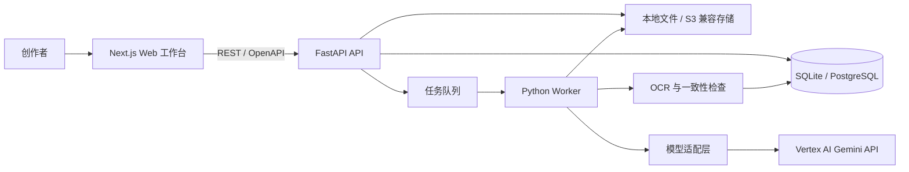

# MangaFlow AI 技术架构

## 1. 架构目标

MangaFlow AI 是本地或私有部署的漫画生产工作台。第一版围绕“导入原作 → 资产 → 剧本 → 分页 → 分镜 → 生成 → 检查 → 修复 → 导出”的闭环建设，并遵守以下边界：

- 结构化数据是事实来源，图片与提示词均是其派生物。
- 浏览器永不持有 Vertex 凭据；所有模型请求只从 API/Worker 发起。
- 长任务统一进入支持依赖关系的任务队列。
- 锁定字段由服务端验证，重新生成不能绕过锁定。
- 模型能力由注册表声明并在运行时探测，UI 只展示真实可用能力。
- 生成、检查、修复均保存模型、参数、提示词版本、输入资产与输出索引。

## 2. 系统边界



本地 MVP 使用 SQLite、本地文件和进程内队列；生产部署将相同端口替换为 PostgreSQL、S3 兼容存储及 Redis/RQ。业务服务不依赖具体存储实现。

## 3. Monorepo 结构

```text
.
├── apps/
│   ├── web/                 # Next.js、React、TypeScript、Tailwind
│   ├── api/                 # FastAPI、Pydantic、SQLAlchemy、Alembic
│   └── worker/              # 队列消费者与任务编排
├── packages/
│   ├── shared-types/        # 前端共享类型与 API 契约
│   ├── prompt-templates/    # 带版本号的提示词模板
│   └── model-adapters/      # 提供商无关接口与 Vertex 实现
├── docs/
├── migrations/
├── storage/
├── uploads/
├── tests/
└── docker-compose.yml
```

## 4. 后端模块

### 4.1 API 层

- `projects`：项目创建、读取、重命名、归档与配置。
- `sources`：原作文本/文件导入，原文不可被 AI 覆盖。
- `assets`：角色、服装、风格、场景和参考图。
- `story`：场景、情节拍、剧本与来源区间。
- `pages`：页面计划、漫画格、锁定与状态流转。
- `jobs`：任务提交、依赖、重试、取消、使用量与错误。
- `models`：能力、可用性与服务端模型选择。
- `exports`：PNG、PDF、JSON 与项目归档。

### 4.2 领域服务

AI 能力拆分为 Story Parser、Adaptation Writer、Visual Director、Page Planner、Storyboard Director、Style Analyzer、Asset Builder、Prompt Compiler、Text Inspector、Continuity Inspector 和 Repair Planner。每个服务：

1. 接受版本化 Pydantic 输入 Schema。
2. 只通过 `TextModelAdapter` 或 `ImageModelAdapter` 调用模型。
3. 对模型结构化输出执行 Schema 校验。
4. 写入一条不可变 `GenerationRecord`。
5. 通过显式状态机提交下一任务。

### 4.3 任务队列

`GenerationJob` 使用邻接表表达 DAG：任务可有多个依赖，只有全部依赖完成后才进入 `QUEUED`。本地实现使用数据库持久化加进程内执行器，生产实现切换到 Redis/RQ。

标准页面链路：

```text
PAGE_GENERATE → OCR_INSPECT → CONTINUITY_INSPECT → REPAIR_PLAN → COMPLETE
```

自动重试仅适用于瞬时错误。内容错误由 Repair Planner 创建新任务，最多自动修复 3 次，随后进入人工审核。

## 5. Vertex AI 模型适配

模型不在业务代码中硬编码，由环境变量选择逻辑别名：

| 逻辑用途 | 默认 Vertex 模型 ID | 用途 | 能力声明 |
| --- | --- | --- | --- |
| `text.fast` | `gemini-3.5-flash` | 解析、改编、分页、分镜、检查 | 多模态输入、文本输出、结构化输出 |
| `image.fast` | `gemini-3.1-flash-image` | Nano Banana 2，草稿与批量页 | 文/图输入，图像生成与编辑，1K/2K/4K |
| `image.quality` | `gemini-3-pro-image` | Nano Banana Pro，关键页与复杂修复 | 文/图输入，图像生成与编辑，1K/2K/4K |

4K 输出在能力表中标注为 Preview；UI 必须显示该标识。适配层启动时检查：凭据存在、项目 ID、区域、SDK 初始化和模型声明。实际调用失败会转为统一错误：认证、权限、配额、限流、模型不可用、能力不支持、内容安全、超时或上游错误。

核心接口：

```python
class TextModelAdapter(Protocol):
    def generate_structured(self, request, output_schema): ...
    def analyze_multimodal(self, request, output_schema): ...

class ImageModelAdapter(Protocol):
    def generate_page(self, request): ...
    def generate_asset(self, request): ...
    def edit_region(self, request): ...
    def analyze_images(self, request, output_schema): ...
    def capabilities(self): ...
    def estimate_cost(self, request): ...
```

## 6. 提示词与锁定

提示词模板以 `template_name + semantic_version + checksum` 标识。Prompt Compiler 只接收已确认的领域对象和锁定字段。锁定验证分两次执行：

- 入队前：拒绝目标字段与锁定字段重叠的修改请求。
- 持久化前：比较输入快照与结果建议，锁定字段发生变化则任务失败并保存差异。

局部修复通过标准化区域坐标和目标类型表达，避免整页重绘。

## 7. 安全

- 服务账号 JSON 由 `GOOGLE_APPLICATION_CREDENTIALS` 指向，仅 API/Worker 读取。
- `.env`、服务账号 JSON、上传素材、数据库和生成输出均被 Git 忽略。
- API 仅返回 `configured/available/error_code`，不返回凭据路径、邮箱、项目唯一标识或认证头。
- 日志过滤密钥、Authorization、原文正文和未授权素材路径。
- 上传执行 MIME、扩展名、大小、文件头与路径穿越检查。
- 本地默认只允许配置的 Web Origin；生产环境由反向代理完成 TLS。

## 8. 部署

开发模式由根目录命令同时启动 Web 与 API。Docker Compose 提供 PostgreSQL 和 Redis，并预留 Web、API、Worker 服务。凭据通过只读卷或平台 Secret 注入，禁止构建进镜像。

## 9. 可观测性

每次模型调用记录：任务 ID、模型 ID、逻辑用途、提示词版本、参数摘要、参考资产 ID、开始/结束时间、使用量、输出文件、重试次数和脱敏错误。健康端点分为应用健康、数据库健康和 Vertex 配置健康，Vertex 健康检查默认不产生模型调用费用。

## 10. 里程碑边界

- M1：工程、数据库、项目、上传、设置和 Vertex 安全配置。
- M2：原作、章节、角色、服装与风格资产。
- M3：剧本、节拍、页面规划与分镜。
- M4：模型适配、任务 DAG 与图像生成。
- M5：OCR、一致性与修复。
- M6：编辑、升清、PNG/PDF/JSON 导出。

未到里程碑的 UI 必须标注“尚未实现”，不得返回静态成功数据。
