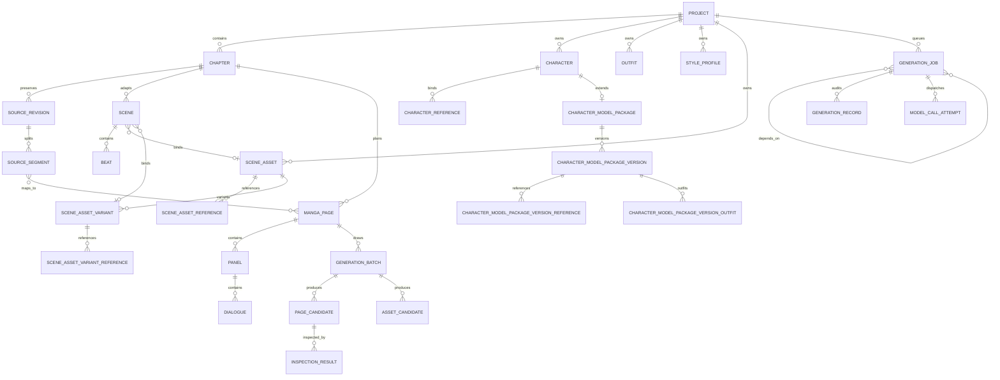
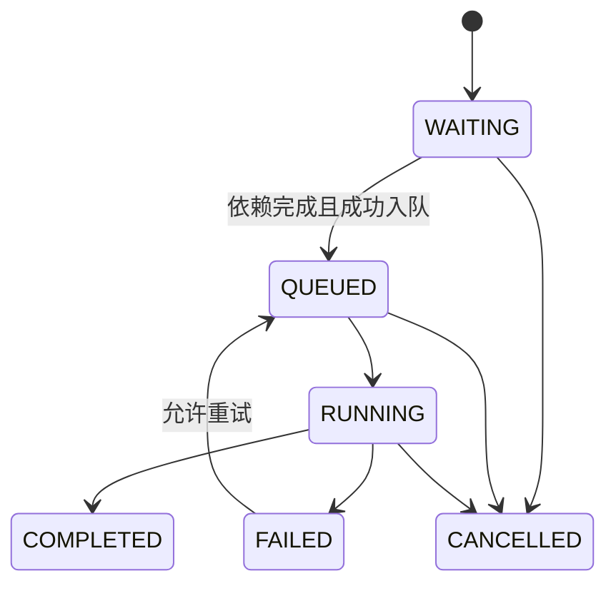
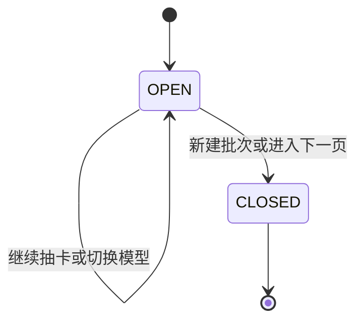

# MangaFlow AI 数据模型与状态机

## 1. 建模原则

- 主键使用 UUID；可编辑实体带时间戳和乐观锁版本。
- 原作修订、生成记录和提示词快照不可变。
- JSON 只承载开放式参数、坐标和快照；需要筛选、约束和追溯的关系使用表。
- 资产只暴露对象 ID/内容接口，不把服务端绝对路径返回浏览器。
- 删除被采用或被后续任务引用的素材时只做软删除。

## 2. 关系总览

P1-5 保留既有 Chapter(project_id, ordinal)、SourceRevision(chapter_id, revision)、GenerationBatch(project_id, ordinal)、PageCandidate(batch_id, ordinal) 与 AssetCandidate(batch_id, ordinal) 唯一约束，不新增迁移。分配尝试在真实外层事务中的保存点完成，唯一键冲突不得回滚调用方其他有效修改；候选、job_id、GenerationJob 及审批运行/节点状态整体提交。原文修订的旧页面清理、段落与修订指针更新也在同一外层事务内完成，最终提交失败不得残留半成品。SQLite 写锁与 PostgreSQL 行锁策略见 architecture.md 的 P1-5 事务章节。

工作流发布仍使用既有 `WorkflowVersion(workflow_id, revision)` 唯一约束，无新增迁移。每次发布的 graph、checksum 与 validation_report 来自事务内重新读取并校验的同一草稿；创建版本和更新 published_version_id 同事务完成。发生发布竞争时回滚并有限重试，失败不得移动已发布指针。



## 3. 关键实体

### Project

保存语言、右至左阅读方向、比例、分辨率、工作模式、并发上限、检查开关和可空的 `last_image_model_alias`。新项目不预选图像模型，用户第一次生成前必须选择；生成后只记录上一次选择。旧字段 `image_model_alias` 仅保留迁移兼容，不代表默认主图像模型。

### Chapter、SourceRevision、SourceSegment

`SourceRevision` 保存原始文本、来源类型、哈希、字符数和修订号。`SourceSegment` 保存原文字符起止区间、顺序、文本与哈希。`PageSourceSegment` 建立片段到页面的覆盖关系，用于计算章节覆盖率和阻断缺失来源的生图请求。

### Character、CharacterReference、Outfit

`Character` 使用 `primary_name` 和 `aliases`，同时保存规范化别名与冲突标记。原文可以用绰号识别角色，剧本与对白的说话人统一写主要姓名。`CharacterReference` 将参考资产绑定到角色和参考类型；服装与风格资产可建立各自的生成批次。

### CharacterModelPackage、CharacterModelPackageVersion（V02-22B 已实现）

`CharacterModelPackage` 与 Character 一对一（`character_id` 唯一索引，FK CASCADE），是既有角色资产的版本化扩展层：`identity_spec`/`visual_spec`/`negative_constraints` 为固定键集合的包级可编辑工作集（未知键 422，取值域见契约 §4.1）；`published_version_id` 是唯一的"当前发布版本"指针（FK SET NULL）；包状态 `ACTIVE/ARCHIVED` 只控制默认继承资格，不影响 Character。`CharacterModelPackageVersion` 以单调 `version_number` 表达不可变版本：状态机 `DRAFT → READY → IN_PRODUCTION → ARCHIVED`（每包至多一个 DRAFT，部分唯一索引），发布时把包工作集冻结为 `spec_snapshot`，此后规格与关系一律只读；`IN_PRODUCTION` 在首个引用候选的同一事务内条件置入（持久状态，非派生；后续默认继承对已 `IN_PRODUCTION` 的发布版本幂等接受）；发布/激活/归档/恢复共享包行锁（PostgreSQL `FOR UPDATE`、SQLite 保存点写锁），发布指针与版本状态同事务落库，不存在半发布状态。绑定与草稿清理另取资产行锁，避免跨角色并发写入同一 Asset。`CharacterModelPackageVersionReference`（`role ∈ cover/front/side/back/three_quarter/expression/pose/extra` + `label`，核心槽禁标签、表情/姿势/扩展必须有标签并带 `sort_order`，逻辑槽唯一索引 `(version_id, role, label)`）与 `CharacterModelPackageVersionOutfit`（每版至多一个 `is_default`，部分唯一索引，切换默认是单事务原子替换）用关系表表达矩阵槽位与服装集，`asset_id`/`outfit_id` FK RESTRICT 指向既有 Asset/Outfit，不复制实体、文件或服装参考图集合。版本选择只发生在生成候选层（`create_page_candidate` 与工作流 GENERATE 审批共用：`reference_selections[char_id].package_version_id` 显式覆盖或默认继承，无包/未发布走 legacy），排队时把包 ID、版本号、规格全文冻结副本、`spec_fingerprint`、实际参考图/服装 Asset ID 与风格事实写入 `prompt_snapshot["character_packages"]`，Worker 只消费排队快照；发布新版本不改变历史候选、不触发页面复核；`GenerationRecord.input_versions["character_packages"]` 记录紧凑版本事实镜像。完整度为服务端读取路径确定性计算的建议指标（DRAFT 读包工作集、READY+ 读冻结快照，权重 20/40/20/20），不落库、不进入生产门禁。契约详见 `docs/v02-character-model-package-contract.md`。

### SceneAsset、SceneAssetReference、SceneAssetVariant

`SceneAsset` 把地点升级为一级资产：结构化字段（`structured` 的 place/subareas/interior/time_of_day/weather/lighting/palette 等固定键集合）、兜底 `description`、`location_hint`（迁移来源展示，只读）、状态、字段锁定与软删除。`SceneAssetReference` 把参考图从 `Asset` 文件池绑定到资产（`(scene_asset_id, asset_id, role)` 唯一）；`SceneAssetVariant` 只允许覆盖时间/天气/光照/色调/季节（`structured_overrides` 键白名单），每资产至多一个 `is_canonical`，`SceneAssetVariantReference` 表达变体级参考图。活跃名称唯一约束为 `(project_id, normalized_name) WHERE deleted_at IS NULL` 部分唯一索引。

`Scene.scene_asset_id` / `scene_asset_variant_id` 是当前采用引用（FK `SET NULL`），**不锁版本**；版本锁定发生在生成边界（候选 `prompt_snapshot`）。历史 `Scene.location` 原样保留、不改写、不回填；绑定校验（项目归属、变体归属、软删状态）由服务端强制执行，非法绑定返回 422。

### Scene、Beat、ScriptRevision

Scene/Beat 逐片段保存地点、时间、动作、对白、旁白、人物和原文来源。`ScriptRevision` 保存剧本修订、结构化内容和来源区间，不允许把整章压缩为少量页面摘要。场景背景消费优先级为：`structured`（变体覆盖后）编译 → 资产 `description` → 历史 `location` 文本；软删或缺失资产与未绑定场景行为一致。

### MangaPage、Panel、Dialogue

`MangaPage` 保存页码、修订号、预计字符/气泡/格数、覆盖率、当前采用候选与连续性状态。`Panel` 保存相对边界、右至左阅读序、镜头、人物、服装、动作和背景；`Dialogue` 保存主要姓名说话人、目标文字、顺序和气泡区域。

坐标统一为 `{x, y, width, height}`，范围 0–1，供不同分辨率复用。

### GenerationBatch、PageCandidate、AssetCandidate

`GenerationBatch` 表示同一目标的一轮抽卡会话，目标可为页面、角色补图、服装图、风格测试或修复图。切换模型不关闭批次；进入下一页或手动新建批次时才关闭。

`PageCandidate` 保存模型别名、真实模型 ID、分辨率、参数、参考资产、任务、输出资产、收藏与软删除状态。每页可收藏多个，但 `MangaPage.selected_candidate_id` 只能指向一个暂选版本；`selected_candidate_ack_version`、候选检查状态与 `continuity_status` 共同决定页面是否生产通过。`AssetCandidate` 为非页面批次提供同样的审计与素材库能力。AI 生成素材被服装档案复用时只新增 `reference_asset_ids` 关系，不改变原始 `Asset.kind/source`，删除服装也不会删除外部生成批次拥有的素材。

`PageCandidate.prompt_snapshot` 在生成边界固化场景资产版本事实：`scene_asset` 快照包含 `scene_asset_id`、`scene_asset_version`、`scene_asset_variant_id`、变体 `structured_overrides` 与编译后的背景文本；资产后续修订不改变历史候选快照，与 `based_on_storyboard_version` 同款不可变语义。`GenerationRecord.input_versions` 记录同一份快照。

### GenerationJob、JobDependency、GenerationRecord

任务保存类型、目标、状态、进度、幂等键、计划/开始/结束时间、租约、取消、尝试次数、超时、模型、参数和脱敏错误。依赖表表达 DAG。`GenerationRecord` 记录不可变的模型、提示词版本、输入版本、参考资产、用量和输出。

### ModelCallAttempt、ModelPricingVersion、ProviderUsageReconciliation

`ModelCallAttempt` 是每次真实上游派发的脱敏账本行，包括 HTTP API 和 CLI 通道、任务/探测关联、章节/页/格/候选维度、终态、延迟与用量来源。`dispatch_request_id` 全局唯一，相同派发重放返回既有行；`outcome=NULL` 表示崩溃或结果未知，不得作为零费用。

结构化计量列为 `input_tokens`、`output_tokens`、`cached_input_tokens`、`output_images` 及 `usage_status/source/unit_kind`。缺失值保持 `NULL + UNKNOWN/PARTIAL`，只有上游明确上报 0 才保存为 0。资产落库晚于上游返回，因此 `output_asset_ids/output_image_dims` 在资产事务提交后以幂等第二阶段挂接；挂接失败保留成功 attempt，并写入脱敏修复标记。

`ModelPricingVersion` 以生效区间保存版本化估算费率。缓存输入按“未缓存输入价 + `cached_input_tokens_per_million`”拆分；缺缓存价时按全价估算并降级为 `PARTIAL`。

`ProviderUsageReconciliation` 保存运营者录入的账单事实，与 estimated 金额分开展示。`(billing_account_id, import_batch_id, idempotency_key)` 唯一；同一账单账号 + provider + model + channel 的周期不得重叠，`connection_id` 只作追溯字段，不拆分账单维度。SQLite 在同一事务内预查，PostgreSQL 另以 `btree_gist` 排他约束作为数据库级竞态保护。

### InspectionResult、RepairPlan、ExportBundle

检查结果关联候选和检查类别，保存识别差异、区域、严重度与建议。修复计划固定按文字区域、气泡区域、单格、整页升级，自动尝试最多三次。`ExportBundle` 保存导出类型、状态、对象键和清单。

`InspectionResult.storyboard_version` 记录模型实际检查时的分镜版本。生产门禁只聚合当前候选、当前分镜版本下五类各自最新的结果；历史版本和未知版本不能补足当前检查。同一类别的时间戳冲突时失败优先，不把 UUID 大小当作时间顺序。迁移 `20260827_17` 新增可空整数列，旧记录保持 `NULL`，不推断或伪造其版本，保留历史且要求重新质检；downgrade 只移除该列。

## 4. 状态机

### 任务状态



队列不可用时保持 `WAITING`；失败隔离到单任务，不回滚同批次的其他候选。

### 批次与候选



候选的收藏与采用是正交状态。候选任务完成前可以收藏，但只有具备输出资产的候选允许采用。换选已采用版本时，后续页面只标记 `NEEDS_REVIEW`，不删除历史候选。

## 5. 供应商与模型能力数据

`ProviderProfile` 保存内置或自定义供应商及风险标签；`ProviderConnection` 保存协议、Base URL、端点模板和健康状态；`ProviderKey` 保存 AES-GCM 密文、末四位提示与轮换/冷却状态；`AIModel` 区分文字和图片模型、输入输出模态、操作、能力来源和验证置信度，并以 `display_enabled` 独立保存创作界面的展示偏好；`ModelProbe` 保存连接、文字、视觉、图片和基准测试结果；`RoutingPolicy` 保存任务级自动路由权重。

`AIModel.enabled` 是持久的调用开关，目录响应的 `enabled` 是当前可用性的派生值，`display_enabled` 只是 UI 展示偏好。三者不得互相覆盖；隐藏模型仍保留真实目录 ID、路由资格、任务引用和审计历史。既有模型经 `20260830_20` 迁移默认回填为展示，新建与发现模型也默认展示。存在隐藏偏好时迁移拒绝降级，避免静默丢失用户设置。

`CLIExecutionRun` 保存一次外部 CLI 派发的持久状态，并关联 `GenerationJob`、唯一的 `ModelCallAttempt`、连接和目录模型。数据库只保存 run token、相对目录、请求 checksum、输出清单、日志 checksum、退出码、错误与清理状态；prompt、参考图和诊断正文留在受控 run 目录。`(connection_id, lease_slot)` 唯一约束提供硬并发名额，终态释放槽位。迁移 `20260831_22` 新建该表；存在审计行时拒绝降级。

```json
{
  "provider": "example-image-provider",
  "protocol": "OPENAI",
  "credential_source": "CONNECTION_KEY",
  "catalog_id": "model_01",
  "model_id": "image-model-v2",
  "logical_alias": null,
  "display_enabled": true,
  "operations": ["image_generate", "image_edit"],
  "resolutions": ["1K", "2K", "4K"],
  "preview_resolutions": ["4K"],
  "regions": ["global"]
}
```

历史别名继续通过唯一兼容解析层指向目录模型；新模型无需别名。UI 依据 API 能力和展示偏好渲染，不在客户端自造模型优先级。

## 6. 主要约束与索引

- 章节序号在项目内唯一；页面编号在章节修订内唯一。
- 片段字符区间必须落在对应原作修订范围内。
- 页面最多 8 个气泡，字符硬上限 180；超过时由规划器拆页。
- 每页最多一个当前采用候选；收藏数量不限。
- 任务幂等键在有效范围内唯一；每项目执行中任务不得超过并发上限。
- 新任务接受目录模型 ID、兼容旧别名或 `auto`；运行前必须验证类型、操作、连接状态和凭据。
- `JobAssetReference` 锁定排队/执行任务正在使用的参考资产，避免验证后被删除或改用途；场景参考图租约集合同时包含资产级与当前变体关系表中的 `asset_id`。
- 场景资产活跃名称在项目内唯一（`deleted_at IS NULL` 部分索引）；变体结构化覆盖只允许时间/天气/光照/色调/季节键；每资产至多一个规范变体。
- 角色模型包（V02-22B 已实现）：包与 Character 一对一唯一；每包至多一个 DRAFT 版本（部分唯一索引）且 `(package_id, version_number)` 唯一；版本参考图逻辑槽 `(version_id, role, label)` 唯一；每版至多一个默认服装（部分唯一索引）；READY 后版本不可变，被历史候选引用的版本不可物理删除。
- 模型调用派发 ID 全局唯一；对账幂等键不得对应不同内容，同一账单维度的周期不得重叠。
- 对项目/状态/优先级、章节/页码、批次/时间、候选/模型/收藏、资产/哈希建立复合索引。

## 7. 迁移策略

Alembic 同时支持 SQLite 与 PostgreSQL。修订版迁移把 `image.fast` 映射为 `image.nano_banana_2`、把 `image.quality` 映射为 `image.nano_banana_pro`，并新增来源、批次、候选、任务和导出表。生产启动只检查迁移版本，不自动执行升级。

迁移 `20260901_23` 扩展 attempt/价格列并新建对账表，对可识别的旧 usage JSON 做幂等结构化回填，无法确定的数量不伪造为 0。降级只删除新表/列；存在无任务归属的付费探测 attempt 时拒绝恢复 `job_id/project_id NOT NULL`，防止静默丢失账本。

迁移 `20260901_24` 新建 `scene_assets` / `scene_asset_references` / `scene_asset_variants` / `scene_asset_variant_references` 四张表，并为 `scenes` 增加两个可空 FK（`SET NULL`）。迁移不做任何数据操作：历史 `location` 文本零触碰、不回填资产行、`scene_asset_id` 保持 NULL；降级在存在场景绑定或新表行时明确拒绝。

迁移 `20260902_25` 新建 `character_model_packages` 等四张表（循环外键两阶段创建：PostgreSQL 先建表后 `ADD CONSTRAINT`，SQLite 内联前向引用；部分唯一索引同时声明两库 `WHERE`），并为每个既有 Character 回填兼容包与 V1 草稿快照（不发布、指针 NULL、只 INSERT 不改写任何既有行）；`CharacterReference.angle` 经确定性映射进入版本槽位（核心槽同名、expression/pose 带 `unspecified` 标签、其余落入 `extra`，碰撞按 `(created_at, id)` 序加 `-{n}` 后缀），软删 Asset 的绑定被跳过，全部服装按 `created_at` 序复制且 `is_default=False`；不复制图片文件，不修改候选/记录/批次。降级在存在发布指针、非 DRAFT 版本、多版本或归档包时拒绝（数据原样保留），子表优先删除（PostgreSQL 先解除 packages→versions 指针约束）。实现与验收以 `docs/v02-character-model-package-contract.md` 为准。
