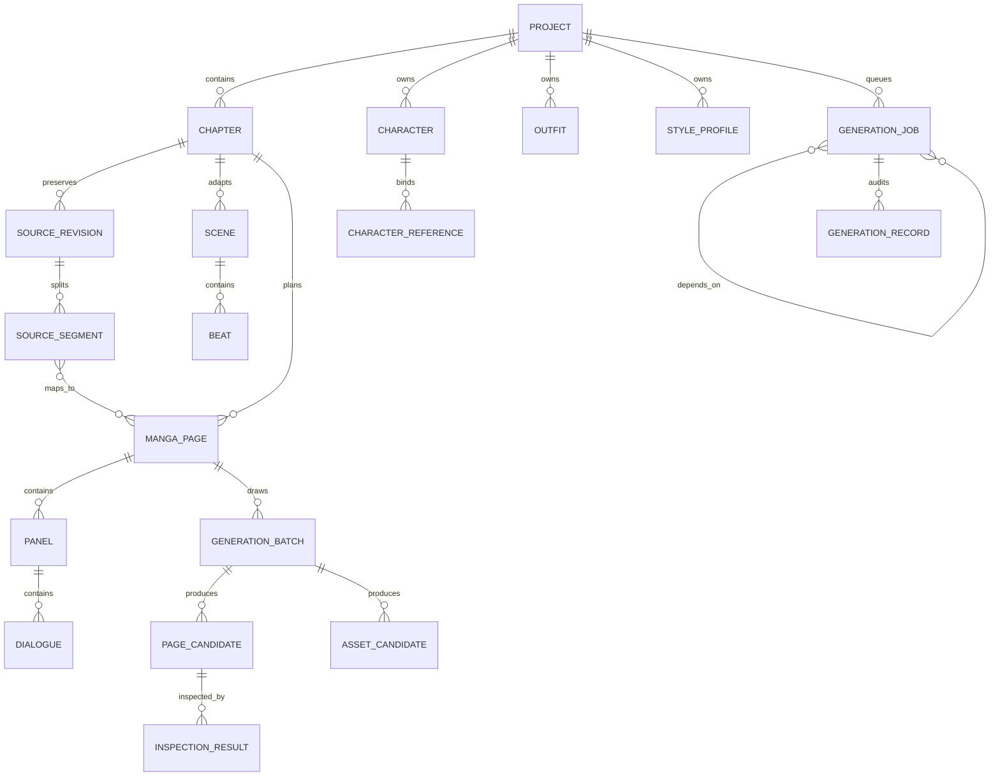
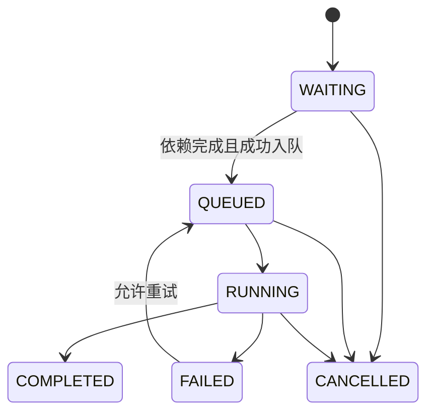
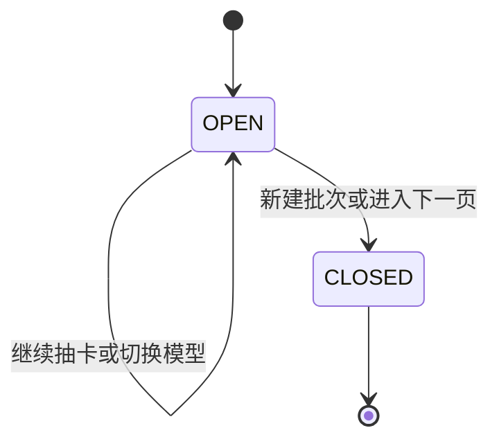

# MangaFlow AI 数据模型与状态机

## 1. 建模原则

- 主键使用 UUID；可编辑实体带时间戳和乐观锁版本。
- 原作修订、生成记录和提示词快照不可变。
- JSON 只承载开放式参数、坐标和快照；需要筛选、约束和追溯的关系使用表。
- 资产只暴露对象 ID/内容接口，不把服务端绝对路径返回浏览器。
- 删除被采用或被后续任务引用的素材时只做软删除。

## 2. 关系总览

P1-5 保留既有 Chapter(project_id, ordinal)、SourceRevision(chapter_id, revision)、GenerationBatch(project_id, ordinal)、PageCandidate(batch_id, ordinal) 与 AssetCandidate(batch_id, ordinal) 唯一约束，不新增迁移。分配尝试在真实外层事务中的保存点完成，唯一键冲突不得回滚调用方其他有效修改；候选、job_id、GenerationJob 及审批运行/节点状态整体提交。原文修订的旧页面清理、段落与修订指针更新也在同一外层事务内完成，最终提交失败不得残留半成品。SQLite 写锁与 PostgreSQL 行锁策略见 architecture.md 的 P1-5 事务章节。

工作流发布仍使用既有 `WorkflowVersion(workflow_id, revision)` 唯一约束，无新增迁移。每次发布的 graph、checksum 与 validation_report 来自事务内重新读取并校验的同一草稿；创建版本和更新 published_version_id 同事务完成。发生发布竞争时回滚并有限重试，失败不得移动已发布指针。



## 3. 关键实体

### Project

保存语言、右至左阅读方向、比例、分辨率、工作模式、并发上限、检查开关和可空的 `last_image_model_alias`。新项目不预选图像模型，用户第一次生成前必须选择；生成后只记录上一次选择。旧字段 `image_model_alias` 仅保留迁移兼容，不代表默认主图像模型。

### Chapter、SourceRevision、SourceSegment

`SourceRevision` 保存原始文本、来源类型、哈希、字符数和修订号。`SourceSegment` 保存原文字符起止区间、顺序、文本与哈希。`PageSourceSegment` 建立片段到页面的覆盖关系，用于计算章节覆盖率和阻断缺失来源的生图请求。

### Character、CharacterReference、Outfit

`Character` 使用 `primary_name` 和 `aliases`，同时保存规范化别名与冲突标记。原文可以用绰号识别角色，剧本与对白的说话人统一写主要姓名。`CharacterReference` 将参考资产绑定到角色和参考类型；服装与风格资产可建立各自的生成批次。

### Scene、Beat、ScriptRevision

Scene/Beat 逐片段保存地点、时间、动作、对白、旁白、人物和原文来源。`ScriptRevision` 保存剧本修订、结构化内容和来源区间，不允许把整章压缩为少量页面摘要。

### MangaPage、Panel、Dialogue

`MangaPage` 保存页码、修订号、预计字符/气泡/格数、覆盖率、当前采用候选与连续性状态。`Panel` 保存相对边界、右至左阅读序、镜头、人物、服装、动作和背景；`Dialogue` 保存主要姓名说话人、目标文字、顺序和气泡区域。

坐标统一为 `{x, y, width, height}`，范围 0–1，供不同分辨率复用。

### GenerationBatch、PageCandidate、AssetCandidate

`GenerationBatch` 表示同一目标的一轮抽卡会话，目标可为页面、角色补图、服装图、风格测试或修复图。切换模型不关闭批次；进入下一页或手动新建批次时才关闭。

`PageCandidate` 保存模型别名、真实模型 ID、分辨率、参数、参考资产、任务、输出资产、收藏与软删除状态。每页可收藏多个，但 `MangaPage.selected_candidate_id` 只能指向一个暂选版本；`selected_candidate_ack_version`、候选检查状态与 `continuity_status` 共同决定页面是否生产通过。`AssetCandidate` 为非页面批次提供同样的审计与素材库能力。AI 生成素材被服装档案复用时只新增 `reference_asset_ids` 关系，不改变原始 `Asset.kind/source`，删除服装也不会删除外部生成批次拥有的素材。

### GenerationJob、JobDependency、GenerationRecord

任务保存类型、目标、状态、进度、幂等键、计划/开始/结束时间、租约、取消、尝试次数、超时、模型、参数和脱敏错误。依赖表表达 DAG。`GenerationRecord` 记录不可变的模型、提示词版本、输入版本、参考资产、用量和输出。

### InspectionResult、RepairPlan、ExportBundle

检查结果关联候选和检查类别，保存识别差异、区域、严重度与建议。修复计划固定按文字区域、气泡区域、单格、整页升级，自动尝试最多三次。`ExportBundle` 保存导出类型、状态、对象键和清单。

`InspectionResult.storyboard_version` 记录模型实际检查时的分镜版本。生产门禁只聚合当前候选、当前分镜版本下五类各自最新的结果；历史版本和未知版本不能补足当前检查。同一类别的时间戳冲突时失败优先，不把 UUID 大小当作时间顺序。迁移 `20260827_17` 新增可空整数列，旧记录保持 `NULL`，不推断或伪造其版本，保留历史且要求重新质检；downgrade 只移除该列。

## 4. 状态机

### 任务状态



队列不可用时保持 `WAITING`；失败隔离到单任务，不回滚同批次的其他候选。

### 批次与候选



候选的收藏与采用是正交状态。候选任务完成前可以收藏，但只有具备输出资产的候选允许采用。换选已采用版本时，后续页面只标记 `NEEDS_REVIEW`，不删除历史候选。

## 5. 供应商与模型能力数据

`ProviderProfile` 保存内置或自定义供应商及风险标签；`ProviderConnection` 保存协议、Base URL、端点模板和健康状态；`ProviderKey` 保存 AES-GCM 密文、末四位提示与轮换/冷却状态；`AIModel` 区分文字和图片模型、输入输出模态、操作、能力来源和验证置信度；`ModelProbe` 保存连接、文字、视觉、图片和基准测试结果；`RoutingPolicy` 保存任务级自动路由权重。

```json
{
  "provider": "vertex-ai",
  "model_id": "gemini-3.1-flash-image",
  "logical_alias": "image.nano_banana_2",
  "operations": ["image_generate", "image_edit"],
  "resolutions": ["1K", "2K", "4K"],
  "preview_resolutions": ["4K"],
  "regions": ["global"]
}
```

Nano Banana Pro 使用同构能力记录和别名 `image.nano_banana_pro`；UI 依据 API 能力渲染，不在客户端自造模型优先级。

## 6. 主要约束与索引

- 章节序号在项目内唯一；页面编号在章节修订内唯一。
- 片段字符区间必须落在对应原作修订范围内。
- 页面最多 8 个气泡，字符硬上限 180；超过时由规划器拆页。
- 每页最多一个当前采用候选；收藏数量不限。
- 任务幂等键在有效范围内唯一；每项目执行中任务不得超过并发上限。
- 新任务接受目录模型 ID、兼容旧别名或 `auto`；运行前必须验证类型、操作、连接状态和凭据。
- `JobAssetReference` 锁定排队/执行任务正在使用的参考资产，避免验证后被删除或改用途。
- 对项目/状态/优先级、章节/页码、批次/时间、候选/模型/收藏、资产/哈希建立复合索引。

## 7. 迁移策略

Alembic 同时支持 SQLite 与 PostgreSQL。修订版迁移把 `image.fast` 映射为 `image.nano_banana_2`、把 `image.quality` 映射为 `image.nano_banana_pro`，并新增来源、批次、候选、任务和导出表。生产启动只检查迁移版本，不自动执行升级。
