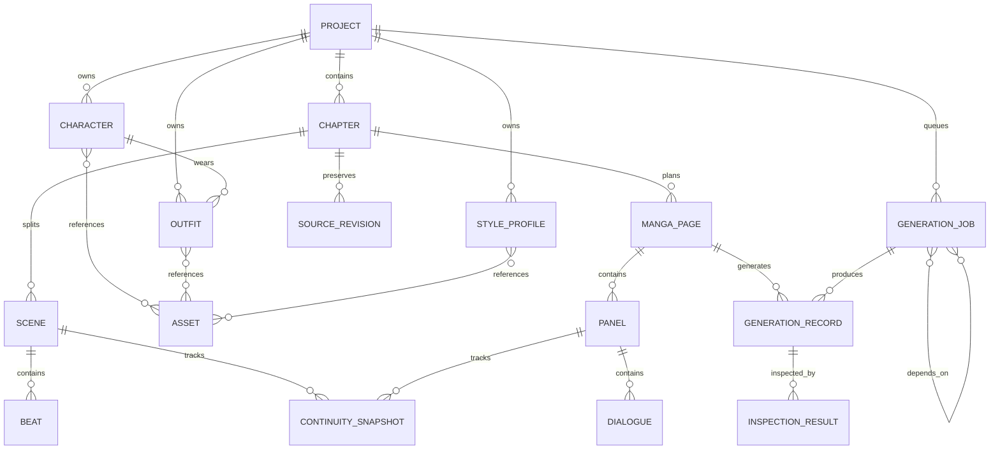
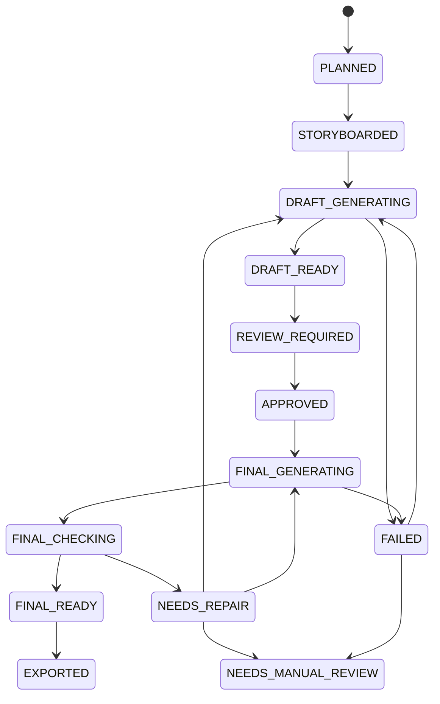
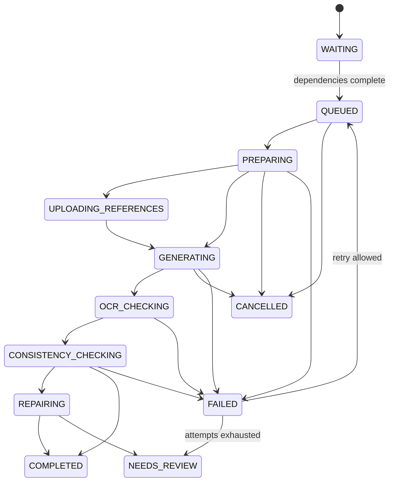

# MangaFlow AI 数据模型与状态机

## 1. 建模规则

- 所有主键使用 UUID，API 使用字符串序列化。
- 所有可编辑实体包含 `created_at`、`updated_at` 和乐观锁 `version`。
- 原作正文与生成记录不可变；修改通过新版本或新记录保存。
- JSON 字段仅用于开放式视觉参数、坐标和状态快照；可查询关系使用正规化表。
- 资产只保存存储对象 ID，不把本地绝对路径暴露给客户端。
- 状态枚举使用大写英文，中文只存在于展示层。

## 2. 关系总览



## 3. 核心实体

### Project

项目保存语言、阅读方向、页面比例、默认分辨率、工作模式、并发上限、OCR/一致性开关、默认模型逻辑别名和阈值。项目删除默认为软删除。

### Chapter 与 SourceRevision

`Chapter` 保存标题、序号与处理状态。`SourceRevision` 保存原始文本、来源类型、文件哈希、字符数与导入时间。AI 绝不覆盖 SourceRevision；用户修改会产生新版本并显式标记当前版本。

### Character、Outfit 与 Asset

`Character` 保存规范描述、锁定特征、禁止改变项和资产状态。`Outfit` 归属角色并保存组件、状态变化规则和规范状态。`Asset` 保存种类、MIME、尺寸、哈希、来源、确认状态和存储键；角色、服装、风格通过关联表引用资产。

### Scene 与 Beat

`Scene` 保存地点、时间、天气、目的、情绪弧、原文依据和服装分配。`Beat` 保存动作、精确对白、旁白、潜台词、情绪、重要度、必须绘制、可合并、翻页悬念及原文区间。

### MangaPage、Panel 与 Dialogue

`MangaPage` 是默认生产单位，保存页面功能、格数、阅读方向、目标分辨率、风格、状态和锁定字段。`Panel` 保存标准化边界、阅读序、镜头、角色、动作、表情、背景、气泡/拟声词区域和连续性。`Dialogue` 保存说话人、精确目标文本、顺序、区域、方向和禁止改写标志。

边界统一使用相对页面的 `{x, y, width, height}`，范围为 0 至 1，便于不同清晰度复用。

### GenerationJob 与 JobDependency

`GenerationJob` 保存任务类型、目标、优先级、状态、尝试次数、最大次数、模型逻辑别名、请求参数、错误分类与取消时间。`JobDependency` 表达 DAG，唯一键为 `(job_id, depends_on_job_id)`，服务端拒绝自依赖和环。

### GenerationRecord

不可变审计记录，包含提供商、模型 ID、区域、参数、提示词模板版本与哈希、输入实体版本、参考资产 ID、请求 ID、开始/结束时间、用量、输出资产、完成状态和脱敏错误。

### InspectionResult 与 RepairPlan

`InspectionResult` 保存检查类别、总分、细分分数、目标/识别文本、差异、区域、严重度和建议。`RepairPlan` 保存最小修复范围、目标字段、锁定冲突、最大重试次数和人工审核原因。

## 4. 枚举

### 工作流模式

`AUTO | DIRECTOR | SEMI_AUTO`

### 来源归因

`EXPLICIT_SOURCE | CONTEXT_INFERENCE | AI_VISUAL_ADDITION | USER_DEFINED | USER_CONFIRMED | CONFLICT`

### 页面状态



服务端使用允许迁移表验证状态，禁止客户端任意写入。`EXPORTED` 不表示冻结，后续修改会生成新页面版本并回到相应状态。

### 角色资产状态

`UPLOADED → ANALYZED → GENERATED → NEEDS_CONFIRMATION → CANONICAL → ARCHIVED`

### 风格状态

`ANALYZING → DRAFT → TEST_GENERATED → CONFIRMED → ACTIVE`

### 任务状态



### 检查结果

`EXACT_MATCH | ACCEPTABLE_DIFFERENCE | AUTO_REPAIR_REQUIRED | MANUAL_REVIEW_REQUIRED`

### 模型错误分类

`AUTHENTICATION | PERMISSION | QUOTA | RATE_LIMIT | MODEL_UNAVAILABLE | UNSUPPORTED_CAPABILITY | SAFETY | TIMEOUT | INVALID_OUTPUT | UPSTREAM | INTERNAL`

## 5. 锁定模型

所有支持生成或修复的对象都有 `locked_fields: list[str]`，使用受控 JSON Pointer 子集，例如：

```json
[
  "/characters/character-id/face",
  "/panels/panel-id/dialogues",
  "/layout"
]
```

API 将修改请求展开为目标路径集合，并检查是否与锁定路径相交。锁定更新本身需要匹配实体 `version`，避免并发覆盖。

## 6. 连续性快照

`ContinuitySnapshot` 最少包含人物位置/朝向/动作、手持物、服装状态、伤势、表情情绪、门窗、天气、光照、时间和关键物品位置。每个快照标明来源面板和置信度；选择下一格参考时，角色规范资产优先于上一格输出。

## 7. 模型能力数据

`ModelCapability` 不是用户生成内容，启动时由版本化注册表加载：

```json
{
  "provider": "vertex-ai",
  "model_id": "gemini-3.1-flash-image",
  "logical_alias": "image.fast",
  "operations": ["generate", "edit", "multi_turn_edit"],
  "resolutions": ["1K", "2K", "4K"],
  "preview_resolutions": ["4K"],
  "max_reference_images": 14,
  "regions": ["global"]
}
```

UI 根据 API 返回的能力渲染选项，不能自行假定模型能力。

## 8. 索引与约束

- `project(name, deleted_at)` 普通索引。
- `chapter(project_id, ordinal)` 唯一。
- `manga_page(chapter_id, page_number, version)` 唯一。
- `panel(page_id, reading_order)` 唯一。
- `generation_job(project_id, status, priority, created_at)` 复合索引。
- `generation_record(job_id, created_at)` 索引。
- `asset(sha256, project_id)` 去重索引。
- 对边界范围、格数 1–8、并发上限、重试上限、分辨率枚举建立数据库或服务端约束。

## 9. 迁移策略

开发环境通过 Alembic 管理 SQLite，生产使用同一迁移链迁移 PostgreSQL。启动时只检查版本，不在生产自动执行迁移。JSON Schema 和提示词模板版本独立于数据库版本记录。
