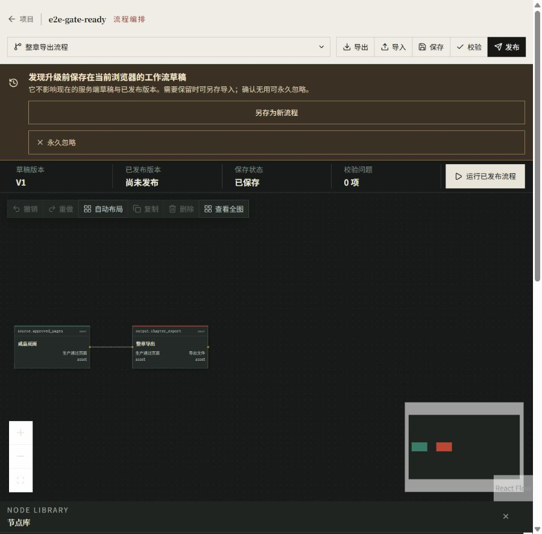

# MangaFlow review — 2026-09-15

Baseline synchronized from `23ae8fc` to `20da7d358d3b3b4c9afc37501480ad8bb224c557` before editing. Publication to `coffe01-10/MangaFlow` was explicitly authorized by the repository owner.

## Findings and corrective changes

| Issues | PR | Finding and correction |
| --- | --- | --- |
| #771, #772 | #783 | Delay numeric clamping until blur; preserve decimal temperatures; clear corrected provider errors; report unsupported reference image formats. |
| #777 | #784 | Controller-kill fixtures used a virtual-environment redirector PID. Use the base interpreter with isolated startup and assert controller identity. Also replace a timing-sensitive worker overlap fixture with an explicit rendezvous and guaranteed engine cleanup. |
| #764 | #785 | Pass a request-local dispatch counter through the real Vertex credential manager; preserve counts in successful and failed audit usage without treating them as billing units. |
| #763 | #786 | Serialize archive, workflow start and retry through the project row. Cancel runs and jobs and write the archive marker in one transaction, without nested commits. |
| #773, #774 | #787 | Explicitly own shared PostgreSQL enum creation/deletion; avoid duplicate table-triggered creation; normalize B1/b1 matching; document btree_gist installation and privileges. |
| #775 | #788 | Type-check scripts/*.mjs with checkJs and correct the declared runner contracts and Node test doubles. |
| #778 | #789 | WPF considered coincident zero-area rectangles intersecting in unarranged sections. Ignore non-rendered headings, retain checks on rendered headings, and inspect model-card TextBlocks instead of StackPanel.ToString(). |
| #790 | #791 | Narrow layouts hid workflow selection and save/validation controls while both panels covered the canvas. Wrap the toolbar and place narrow-screen panels in document flow. |

The original documentation-only PR #782 was reviewed separately. Its original CI failures were the controller-kill and worker-overlap fixture failures corrected in #784.

## Independent validation

- Web fix baseline: complete `npm run check`; Python 1602 passed / 37 skipped; Vitest 592 passed in 53 files; lint, script types and production build passed.
- Focused Web regression run: 132 passed across four files.
- Focused backend/process regression run: 154 passed.
- PostgreSQL 16.15 on an isolated loopback-only instance: 24 passed, including split upgrades, full downgrade/re-upgrade, B1/b1 backfill, and four real two-session archive/start/retry races. Contention was verified with `pg_blocking_pids`, not inferred from sleeps.
- Node runner tests: 16 passed; script type checks passed.
- Native Release build and `--render`: 56 client checks plus WPF navigation and visual checks passed, including 940px / 1320px layouts and the page-state matrix.
- Built-in browser: numeric input accepts successive `4` then `45`; timeout 45 and temperature 0.45 persist after reload and workflow reselection.

- Final combined `npm run check` at `85b10e9`: Python **1611 passed / 43 skipped**; Vitest **592 passed / 53 files**; provider-neutrality, ESLint, Ruff, both script TypeScript projects and production Next.js build passed.
- Responsive built-in browser checks at **390, 914 and 1320 pixels** passed. Workflow selection was exercised at 390px; toolbar actions remain available, and panels follow the canvas without overlap. Verified source, characters, script, storyboard, generation, library, jobs, project settings, system settings, usage and help states. Invalid provider URL feedback disappears when the URL is corrected. Browser error log: empty in the final session.

Additional evidence: [1320px desktop](web-workflow-1320.png), [persisted numeric inputs](web-workflow.png), [native generation at 940px](native-generate-940.png). The browser's 390px full-page capture contained stitching artifacts and was discarded; the 390px interaction checks used live viewport observations.

## Boundaries and resource ownership

Live paid provider dispatches and Redis/RQ acceptance were not run. The native interaction suite does not establish physical mouse double-click timing. Browser checks use isolated fixture data and no provider credentials. No claim is made that undiscovered defects cannot exist.

The temporary PostgreSQL instance was stopped and its verified directory removed. The first browser runtime was stopped; its stop marker initially triggered the ownership directory's fail-closed cleanup check, so that known marker was removed and the stopped-directory cleanup successfully retried.

A browser session interrupted while continuing the task was recovered through the exact ownership token. The final browser runtime stopped and removed its directory successfully through the controller. Viewport overrides were reset. Only the report and selected evidence images remain; temporary native render directories were removed after retaining the relevant screenshot.

After merging #783, every worktree was inspected. Existing untracked files in `漫画工作流-ui-dev`, `漫画工作流-wt-a`, and `漫画工作流-wt-b` were preserved. All seven other worktrees had zero commits absent from master. Only clean worktrees may be fast-forwarded after the final merge.
